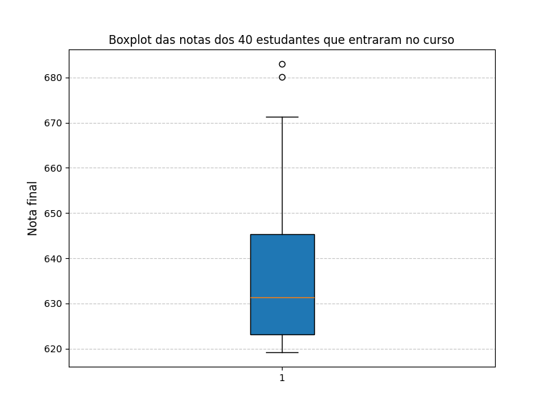

# 📊 Análise de Desempenho no ENEM 2023

Este repositório contém uma análise exploratória dos dados fictícios do ENEM 2023, com foco na seleção de estudantes para o curso de Ciência da Computação da UFPE. Utilizamos estatística descritiva e visualização de dados para extrair insights sobre as notas.
Um Exercício para o bootcamp Data Analytics da Woomakerscode

### 📌 Objetivos

✔️ Identificar a disciplina com maior variação de notas.✔️ Calcular médias e medianas das disciplinas.✔️ Selecionar os 500 melhores estudantes e analisar suas notas.✔️ Determinar os 40 aprovados e calcular a variância e a média das notas.✔️ Gerar visualizações, como boxplots, para entender a distribuição das notas.

### 📂 Estrutura do Repositório

enem_2023.json - Base de dados

analise.py - Código principal contendo toda a análise de dados.

README.md - Instruções sobre o projeto.

### ⚙️ Como Rodar o Projeto

Clone o repositório:
```
git clone https://github.com/JoyAssis/womakerscode_dataAnalystics_etatistica.git

cd enem-analise
```
Instale as dependências:
```
pip install pandas numpy matplotlib
```
Execute a análise:
```
python analise.py
```
### 📊 Principais Insights

📌 A maior variação de notas foi observada na disciplina X.📌 A nota média dos 500 melhores estudantes foi Y.📌 Para ser aprovado, um candidato precisou de pelo menos Z pontos.📌 A distribuição das notas dos aprovados indica que...

### 🎨 Visualizações

Foram gerados boxplots e outras análises para entender melhor os dados.


📢 Contribuição

Sugestões e melhorias são bem-vindas! Feel free to fork, criar PRs ou abrir issues. 🚀